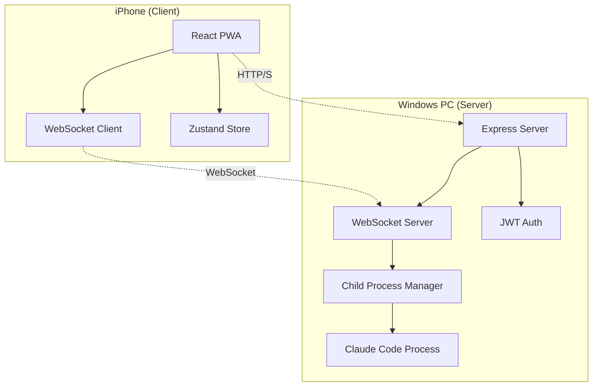

# アーキテクチャ設計書

## システム概要



## コンポーネント詳細

### フロントエンド（Client）

#### 技術スタック
- **React 18**: UIフレームワーク
- **TypeScript**: 型安全性
- **Vite**: ビルドツール（高速HMR）
- **Zustand**: 状態管理（軽量）
- **PWA**: Progressive Web App対応

#### 主要コンポーネント

```
src/
├── components/
│   ├── Login.tsx          # 認証画面
│   ├── Terminal.tsx       # ターミナル表示
│   ├── CommandInput.tsx   # コマンド入力
│   └── StatusBar.tsx      # 接続状態表示
├── store.ts              # グローバル状態管理
├── types/                # 型定義
└── utils/                # ユーティリティ関数
```

#### 状態管理フロー

```typescript
// Zustandストアの構造
interface AppState {
  // 認証状態
  isAuthenticated: boolean;
  token: string | null;
  
  // WebSocket状態
  wsStatus: 'disconnected' | 'connecting' | 'connected' | 'error';
  ws: WebSocket | null;
  
  // ターミナル状態
  terminalLines: TerminalLine[];
  
  // アクション
  connectWebSocket: () => void;
  sendCommand: (command: string) => void;
  // ...
}
```

### バックエンド（Server）

#### 技術スタック
- **Node.js**: ランタイム
- **Express**: HTTPサーバー
- **ws**: WebSocketライブラリ
- **child_process**: プロセス管理
- **JWT**: 認証トークン
- **bcrypt**: パスワードハッシュ化

#### アーキテクチャパターン

```javascript
// レイヤー構造
├── HTTP Layer (Express)
│   ├── Authentication API
│   └── Health Check API
├── WebSocket Layer
│   ├── Connection Management
│   ├── Message Routing
│   └── Session Management
└── Process Layer
    ├── Claude Code Spawning
    ├── I/O Stream Management
    └── Process Lifecycle
```

### 通信プロトコル

#### WebSocketメッセージフォーマット

```typescript
// クライアント → サーバー
interface ClientMessage {
  type: 'auth' | 'command' | 'interrupt' | 'close';
  token?: string;
  text?: string;
}

// サーバー → クライアント
interface ServerMessage {
  type: 'auth' | 'output' | 'error' | 'processEnd';
  status?: 'success' | 'failed';
  text?: string;
  message?: string;
  code?: number;
}
```

#### 認証フロー

```
1. Client → Server: POST /api/login { username, password }
2. Server: Validate credentials
3. Server → Client: { token: "JWT..." }
4. Client → WebSocket: { type: 'auth', token }
5. Server: Validate JWT
6. Server → Client: { type: 'auth', status: 'success' }
```

### セキュリティ設計

#### 現在の実装
- JWT認証（HS256）
- bcryptパスワードハッシュ（salt rounds: 10）
- CORS制限

#### 推奨改善点
1. **HTTPS/WSS必須化**
2. **Rate Limiting実装**
3. **コマンドホワイトリスト**
4. **監査ログ**

### スケーラビリティ考慮

#### 現在の制限
- シングルプロセス
- インメモリセッション管理
- 1対1のWebSocket接続

#### 将来の拡張性
```javascript
// マルチセッション対応案
class SessionManager {
  sessions = new Map<string, Session>();
  
  createSession(userId: string): Session {
    const session = new Session();
    this.sessions.set(session.id, session);
    return session;
  }
}

// プロセスプール案
class ProcessPool {
  private pool: ChildProcess[] = [];
  private maxProcesses = 10;
  
  async getProcess(): Promise<ChildProcess> {
    // プロセスの再利用ロジック
  }
}
```

### データフロー

```
1. ユーザー入力
   ↓
2. React Component (CommandInput)
   ↓
3. Zustand Store Action
   ↓
4. WebSocket Send
   ↓
5. Server Message Router
   ↓
6. Child Process stdin
   ↓
7. Claude Code Execution
   ↓
8. stdout/stderr Capture
   ↓
9. WebSocket Broadcast
   ↓
10. Zustand Store Update
    ↓
11. React Component Re-render (Terminal)
```

### エラーハンドリング戦略

#### クライアント側
```typescript
// 自動リトライ with exponential backoff
const reconnect = (attempt = 0) => {
  const delay = Math.min(1000 * Math.pow(2, attempt), 30000);
  setTimeout(() => connectWebSocket(), delay);
};
```

#### サーバー側
```javascript
// グレースフルシャットダウン
process.on('SIGTERM', async () => {
  wss.clients.forEach(client => {
    client.send(JSON.stringify({ 
      type: 'error', 
      message: 'Server shutting down' 
    }));
    client.close();
  });
  server.close();
});
```

### パフォーマンス最適化

#### メモリ管理
- ターミナル出力を1000行に制限
- 定期的なガベージコレクション
- ストリーミング処理

#### ネットワーク最適化
- WebSocketメッセージのバッチング検討
- 圧縮（ws permessage-deflate）
- Keep-aliveピング実装

### 監視・ロギング

#### 推奨メトリクス
- WebSocket接続数
- コマンド実行数/分
- エラーレート
- レスポンスタイム
- メモリ使用量

#### ログフォーマット
```json
{
  "timestamp": "2025-08-03T10:00:00Z",
  "level": "info",
  "userId": "1",
  "sessionId": "abc123",
  "action": "command",
  "command": "ls -la",
  "duration": 150,
  "status": "success"
}
```

---
最終更新: 2025年8月3日